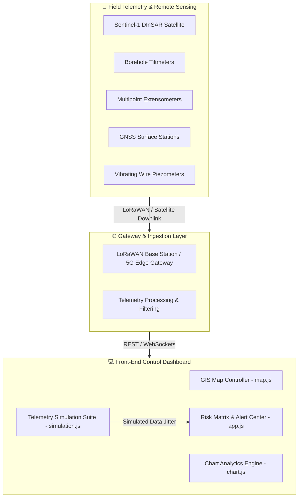

# Mine Subsidence Early Warning System 🚨⛰️

[](https://opensource.org/licenses/MIT)
[](https://developer.mozilla.org/en-US/docs/Web/HTML)
[](https://developer.mozilla.org/en-US/docs/Web/CSS)
[](https://developer.mozilla.org/en-US/docs/Web/JavaScript)
[](https://leafletjs.com/)
[](https://www.chartjs.org/)
[](https://vercel.com)

A **Real-Time GIS & Geotechnical Ground Stability Monitoring Dashboard** engineered to detect early signs of surface subsidence above underground coal mines, predict roof collapse hazards, and issue automated early warning alerts to safeguard mining personnel and nearby civil infrastructure.

---

## 📌 Executive Summary

Underground coal extraction (longwall mining and room-and-pillar goaf extraction) creates subsurface voids that frequently cause surface ground deformation and catastrophic mine subsidence. 

This **Mine Subsidence Early Warning System** integrates real-time telemetry from IoT geotechnical sensors (*Borehole Tiltmeters, Multipoint Extensometers, GNSS Nodes, Piezometers*) with satellite synthetic aperture radar (**DInSAR - Differential Interferometric SAR**) to provide high-precision early warnings before surface cracking or structural collapse occurs.

---

## 🌟 Key Features

* **🗺️ Real-Time GIS Hazard Layering**:
  * Leaflet GIS engine with Esri Dark Gray Canvas base maps.
  * Color-coded dynamic hazard polygons (**Critical 🔴**, **Warning 🟠**, **Watch 🟡**, **Safe 🟢**).
  * Underground tunnel galleries overlay (Trunk incline drifts, extraction panels, crosscuts).
  * Surface asset overlay (Village settlements, access highways, natural drainage streams).

* **📈 Time-Series Subsidence Analytics**:
  * Dynamic line charts monitoring 24-hour displacement velocity & cumulative settlement.
  * Multi-tier alert threshold lines: **Normal (<5 mm)**, **Warning (12 mm)**, and **Critical (>15 mm)**.

* **📡 Comprehensive IoT Sensor Telemetry**:
  * Real-time monitoring of 50+ deployed field nodes.
  * Wireless diagnostic readouts (LoRaWAN dBm signal levels, battery %, poll intervals).

* **⚡ Interactive Hazard Simulation Suite**:
  * **Heavy Rain Infiltration Simulation**: Tests pore-water pressure increases and soil saturation effects.
  * **Displacement Spike Event**: Simulates accelerated roof movement directly over active extraction panels.
  * Micro-fluctuation telemetry engine generating 4-second live jitter data streams.

* **🎨 Control-Room Ready Responsive UI**:
  * Sleek dark mode visual hierarchy, glassmorphism telemetry cards, and ambient pulsing danger animations.
  * Built-in Theme Switcher (Dark / Light) and multi-site dropdown support (*Singareni, Jharia, Korba, Raniganj*).

---

## 📐 Mathematical & Geotechnical Model

### 1. DInSAR Satellite Line-of-Sight (LOS) Displacement
Surface displacement $\Delta d_{\text{LOS}}$ is calculated from interferometric phase differences ($\Delta \phi$):

$$\Delta d_{\text{LOS}} = \frac{\lambda \cdot \Delta \phi}{4\pi}$$

Where:
* $\lambda$ = Radar wavelength (e.g., $5.546 \text{ cm}$ for C-band Sentinel-1).
* $\Delta \phi$ = Unwrapped interferometric phase change between repeat satellite passes.

### 2. Subsidence Velocity Threshold ($V_s$)
Deformation velocity is continuously computed over time window $\Delta t$:

$$V_s = \frac{d(t_2) - d(t_1)}{\Delta t}$$

* **Normal Operational State**: $V_s < 1.0 \text{ mm/day}$
* **Alert Warning Level**: $1.0 \text{ mm/day} \le V_s < 3.0 \text{ mm/day}$
* **Critical Evacuation Level**: $V_s \ge 3.0 \text{ mm/day} \text{ or cumulative displacement } > 15 \text{ mm}$

---

## 🏛️ System Architecture



---

## 🛠️ Hardware & Telemetry Specifications

| Sensor Type | Parameters Monitored | Measurement Precision | Poll Frequency | Protocol |
| :--- | :--- | :--- | :--- | :--- |
| **Borehole Tiltmeter** | Surface & Subsurface Tilt Angle ($\theta$) | $\pm 0.001^\circ$ | 1 Minute | LoRaWAN 865 MHz |
| **MPX Extensometer** | Subsurface Roof Strata Separation | $\pm 0.01 \text{ mm}$ | 5 Minutes | Modbus RTU / RS485 |
| **InSAR (Sentinel-1)** | Line-of-Sight Surface Displacement | $\pm 2.0 \text{ mm}$ | 6 to 12 Days | ESA Copernicus Hub |
| **Vibrating Wire Piezometer** | Groundwater Pore Pressure | $\pm 0.1 \% \text{ FS}$ | 15 Minutes | Cellular NB-IoT |
| **Optical Prism Target** | Total Station Coordinate Drift ($X,Y,Z$) | $\pm 0.5 \text{ mm}$ | Automated Robotic Scan | Ethernet / Fiber |

---

## 🚨 Alert Escalation Matrix

| Risk Level | Score Range | Displacement ($d$) | Action Required |
| :--- | :--- | :--- | :--- |
| 🟢 **SAFE** | 0 – 30 | $< 5.0 \text{ mm}$ | Routine monthly sensor calibration & baseline survey. |
| 🟡 **WATCH** | 31 – 60 | $5.0 – 11.9 \text{ mm}$ | Continuous automated tracking; dispatch visual ground inspection team. |
| 🟠 **WARNING** | 61 – 80 | $12.0 – 14.9 \text{ mm}$ | Increase sensor polling frequency to 1 min; inspect drainage channels & pillars. |
| 🔴 **CRITICAL** | 81 – 100 | $\ge 15.0 \text{ mm}$ | **Immediate Evacuation** of high-risk zone & close overlying access roads. |

---

## 📂 Project Structure

```
mine-earlywarning-system/
├── index.html         # Main control room dashboard HTML container
├── css/
│   └── styles.css     # CSS custom variables, dark theme design tokens & animations
├── js/
│   ├── app.js         # Application controller, UI state rendering & alerts
│   ├── chart.js       # Chart.js time-series trend controller & threshold lines
│   ├── data.js        # Site metadata, sensor telemetry & hazard zone geometry
│   ├── map.js         # Leaflet GIS map initialization, overlays & sensor pins
│   └── simulation.js  # Live telemetry simulator & interactive event triggers
├── LICENSE            # MIT Open Source License
└── README.md          # Comprehensive technical documentation
```

---

## 🚀 Getting Started

### Prerequisites
No build tools or server dependencies required! The application runs in any modern web browser (*Chrome, Firefox, Edge, Safari*).

### Local Execution

1. **Clone the repository**:
   ```bash
   git clone https://github.com/varshithaaaagedda/mine-earlywarning-system.git
   cd mine-earlywarning-system
   ```

2. **Launch with local web server**:
   Using Node.js `http-server`:
   ```bash
   npx http-server -p 8080
   ```
   Or using Python:
   ```bash
   python -m http.server 8080
   ```

3. **View Dashboard**:
   Open [`http://localhost:8080`](http://localhost:8080) in your web browser.

---

## 🤝 Contributing

Contributions, issues, and feature requests are welcome!
1. Fork the Project.
2. Create your Feature Branch (`git checkout -b feature/AmazingFeature`).
3. Commit your Changes (`git commit -m 'Add some AmazingFeature'`).
4. Push to the Branch (`git push origin feature/AmazingFeature`).
5. Open a Pull Request.

---

## 📜 License

Distributed under the **MIT License**. See [`LICENSE`](file:///c:/Users/BHAVANI/OneDrive/Desktop/sih/LICENSE) for more details.
